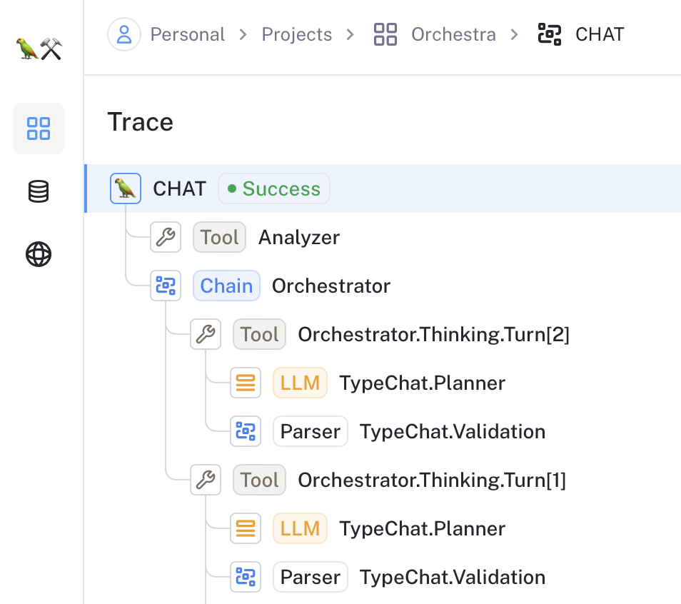

# TypeAgent

TypeAgent is an experimental opinionated library that makes it easy to build generative AI agents using TypeScript type system. This is based on the work pioneer by [TypeChat](https://microsoft.github.io/TypeChat/) by Microsoft.

# Getting Started

Install TypeAgent:

```
npm install typeagent
```

## TypeChat

TypeAgent depends on TypeChat, which relies on the environment variables to create the default model abstractions:

```env
OPENAI_API_KEY=ADD_YOURS_HERE # https://platform.openai.com/account/api-keys
OPENAI_MODEL=gpt-4
```

## LangSmith

TypeAgent indirectly uses [LangSmith](https://smith.langchain.com/). If you plan to use TypeAgent, we recommend you [sign up for a LangSmith account](https://smith.langchain.com/). You can use it for development and testing, which helps greatly with debugging the orchestrator and the agents. See the following screenshot:



For LangSmith to work, you must define the following environment variables:

```env
LANGCHAIN_TRACING_V2=true
LANGCHAIN_ENDPOINT=https://api.smith.langchain.com
LANGCHAIN_API_KEY=ADD_YOURS_HERE # https://smith.langchain.com/
LANGCHAIN_PROJECT=YourProjectName
```

# Contributing

Just send the pull request.

You can build TypeAgent from source:

```
npm run build
```

To see TypeAgent in action, we recommend exploring the [TypeAgent example projects](./examples). You can try them on your local machine or in a GitHub Codespace.

